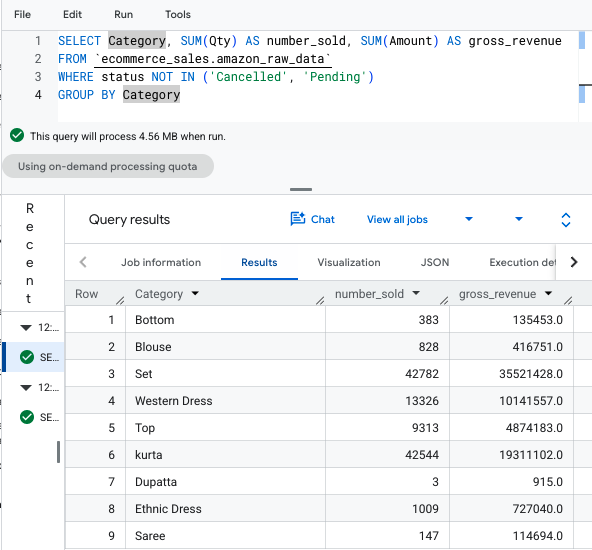
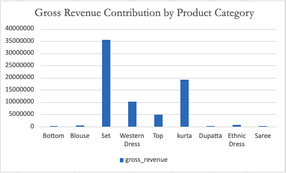

# Amazon E-Commerce Operations & Cloud Analytics Pipeline

## Project Overview
Demonstrates a data pipeline transitioning from 110,000+ raw, e-commerce records into a business intelligence visualization.

## Architecture
1. **Cloud Data:** Loaded the raw dataset into Google's BigQuery Cloud Platform environment.
2. **SQL Transformation & Aggregation:** Wrote optimizing query utilizing SQL logic to isolate valid data records, turning the data into distinct performance tiers.
3. **Cross Functional Data Modeling:** Exported condensed data from BigQuery into Excel to construct cross-sheet relational links with `XLOOKUP` in order to map products and their categories to their respective team leads.
4. **Visualization:** Developed reporting metrics that show the gross revenue contribution per product stream.

## SQL Script
```sql
SELECT Category, SUM(Qty) AS number_sold, SUM(Amount) AS gross_revenue
FROM `ecommerce_sales.amazon_raw_data`
WHERE status NOT IN ('Cancelled', 'Pending')
GROUP BY Category;
```
## Reporting Dashboards

### Cloud Data Pipeline (Big Query Console)


### Executive Revenue Summary (Excel)

